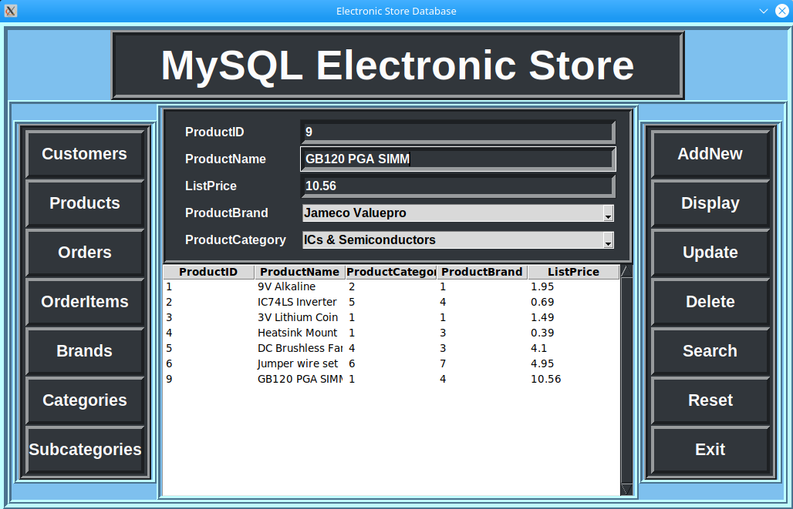
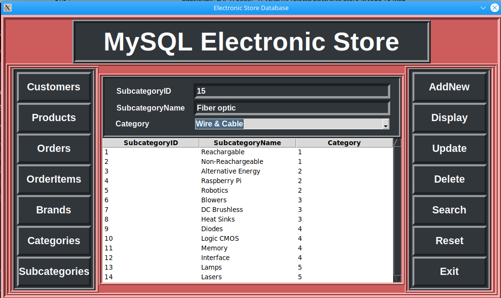

# Electronic Store MySQL
## General info
Graphic user interface to support the database of the electronic store. The functionality of the interface ensures easy editing of database records.

In the project, I connected communication with the MySQL (MariaDB) database through a script written in Python - pymysql framework

## Technologies
MariaDB, MySQL, Python3.7, Tkinter, pymysql
## Screenshots
Some of cards available in the graphical interface:

